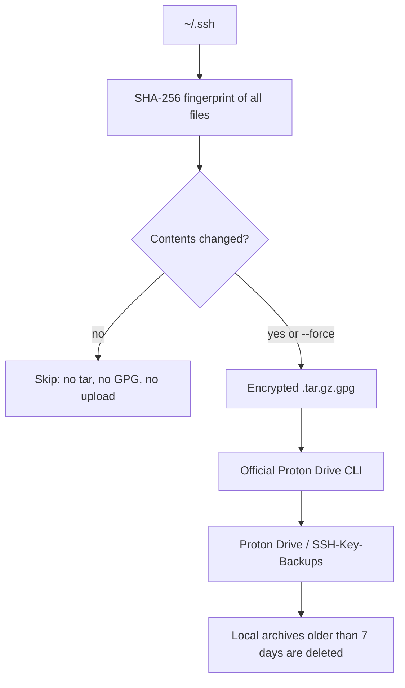

# SSH Proton Backup

Encrypted, change-based backup of `~/.ssh` to [Proton Drive](https://proton.me/drive), using the [official Proton Drive CLI](https://proton.me/support/drive-cli).

A backup is created only when an SSH key, config, or other file under `~/.ssh` actually changes.



## What is Proton Drive?

[Proton Drive](https://proton.me/drive) is Proton’s end-to-end encrypted cloud storage (the same Swiss company behind Proton Mail). Files are encrypted on your device; Proton cannot read them.

This project talks to Drive through the [official Proton Drive CLI](https://proton.me/support/drive-cli), not rclone and not the web UI. Sign-in is browser-based. The session is stored in the Linux secret store (libsecret), never in `.env`. Your Proton account password is never written to this repo.

You need a Proton account. Free Drive space is enough: `~/.ssh` is typically a few kilobytes.

## Why it is fast

- `~/.ssh` is tiny (usually kilobytes, not gigabytes).
- Every run hashes all files in that directory. If the fingerprint matches the last successful backup, the script exits immediately — no tar, no GPG, no upload.
- When a key *does* change, a systemd path unit runs the backup after a 3-second delay (so `ssh-keygen` can finish writing both the private and public key), instead of waiting until 20:00.
- A daily 20:00 timer is only a fallback. Both triggers still skip the upload when nothing changed.

## Why it is safe

- **Double encryption:** Proton already encrypts at rest. Archives are also wrapped with GPG AES-256 before upload, so a downloaded file is useless without your passphrase.
- **Restore never overwrites live keys.** The restore script refuses to extract into `~/.ssh`.
- **Proton password stays out of this project.** Only `GPG_PASSPHRASE` lives in a mode-`600` `.env` on your machine.
- Local encrypted copies older than 7 days are deleted. Copies on Proton Drive stay.
- Proton fair-use guidance matches the change-based design: identical archives are not re-uploaded every day.

If you lose `GPG_PASSPHRASE`, those archives cannot be decrypted. Store the passphrase in a password manager or on paper.

## Requirements

- Linux with systemd **user** sessions (typical desktop install)
- `gpg`, plus `curl` or `wget`
- A Proton account
- CPU: x86_64 or aarch64

macOS and Windows are not supported. There is no Docker image; see [Why not Docker?](#why-not-docker).

## Quick start

```bash
git clone https://github.com/Thrima97/ssh-proton-backup.git
cd ssh-proton-backup
make install
proton-drive auth login
make backup-force
```

`make install` runs [install.sh](install.sh). It:

1. Checks for `gpg`, `libsecret`, and D-Bus tools
2. Downloads Proton Drive CLI 0.8.0, verifies the published SHA-512, and installs it to `/usr/local/bin` or `~/.local/bin`
3. Creates `~/.config/ssh-backup/.env` from `.env.example` if needed
4. Prompts for `GPG_PASSPHRASE` when stdin is a terminal
5. Copies the backup/restore scripts to `~/.local/bin`
6. Copies `lib/env.sh` to `~/.local/lib/ssh-proton-backup/env.sh`
7. Enables the systemd user timer at 20:00 and the path watcher on `~/.ssh`
8. Creates `/my-files/SSH-Key-Backups` if you are already logged in

Non-interactive install (skip the password prompt):

```bash
SKIP_PASSPHRASE=1 make install
```

Then edit `~/.config/ssh-backup/.env` yourself.

Pin a release instead of `main`:

```bash
git clone --branch v0.1.0 https://github.com/Thrima97/ssh-proton-backup.git
```

See [docs/releasing.md](docs/releasing.md) for how versions are published.

## Makefile

| Target | Action |
| --- | --- |
| `make` / `make help` | List targets |
| `make install` | Run the installer |
| `make uninstall` | Remove scripts and systemd units; keep config and local archives |
| `make uninstall-purge` | Uninstall and delete local config and encrypted archives (not Proton copies) |
| `make check` | Run `shellcheck` on the scripts |
| `make backup` | Change-based backup |
| `make backup-force` | Backup even if `~/.ssh` has not changed |
| `make restore ARCHIVE=path DEST=dir` | Decrypt an archive into a new folder |

## Configuration (`.env`)

All paths and the encryption password live in a `.env` file. The scripts never store your Proton password.

Live file (mode `600`):

```
~/.config/ssh-backup/.env
```

Search order:

1. `SSH_BACKUP_ENV` if you set that variable
2. `~/.config/ssh-backup/.env`
3. `.env` next to the script (useful when running from this repo)

`.env.example` is the committed template. A real `.env` is gitignored.

### Create or edit `.env`

If `~/.config/ssh-backup/.env` is missing:

```bash
mkdir -p ~/.config/ssh-backup
chmod 700 ~/.config/ssh-backup
cp .env.example ~/.config/ssh-backup/.env
chmod 600 ~/.config/ssh-backup/.env
```

Then set the encryption password:

```bash
nano ~/.config/ssh-backup/.env
```

Set:

```bash
GPG_PASSPHRASE='your-strong-password-here'
```

Quote the value if it contains spaces or special characters.

### Variables

| Variable | Default | Purpose |
| --- | --- | --- |
| `SSH_DIR` | `$HOME/.ssh` | Directory to archive |
| `WORK_DIR` | `$HOME/.local/state/ssh-backups` | Local encrypted archives and last fingerprint |
| `PROTON_PARENT` | `/my-files` | Proton Drive parent path |
| `PROTON_FOLDER` | `SSH-Key-Backups` | Folder name under that parent |
| `PROTON_DIR` | `/my-files/SSH-Key-Backups` | Full upload destination |
| `LOCAL_RETENTION_DAYS` | `7` | Delete local archives older than this. Proton copies stay. |
| `GPG_CIPHER` | `AES256` | Symmetric cipher |
| `GPG_PASSPHRASE` | *(required)* | Password used to encrypt/decrypt archives |
| `GPG_PASSPHRASE_FILE` | unset | Optional 600 file instead of `GPG_PASSPHRASE` |
| `FINGERPRINT_FILE` | `$WORK_DIR/last-fingerprint` | Last successful content hash |

Override the file for one run:

```bash
SSH_BACKUP_ENV=/path/to/.env ~/.local/bin/ssh-proton-backup.sh --force
```

## Proton login (once)

Sign-in is through the browser. The session is stored in libsecret, not in `.env`.

```bash
proton-drive auth login
proton-drive filesystem create-folder /my-files SSH-Key-Backups
proton-drive filesystem list /my-files
```

`create-folder` can be skipped if the folder already exists.

## First test

After `GPG_PASSPHRASE` is set:

```bash
make backup-force
```

Expected result:

- Encrypted file under `~/.local/state/ssh-backups/`
- Same filename in Proton Drive `/my-files/SSH-Key-Backups`
- Later runs without `--force` print `No SSH changes; skipping upload` until `~/.ssh` changes

## Schedule

Two triggers:

1. **Path watcher** — when a file in `~/.ssh` is created or changed, the backup runs after a 3-second delay (so `ssh-keygen` can finish writing both the private and public key).
2. **Daily timer** — 20:00 fallback if a change was missed.

Both still skip the upload when the fingerprint is unchanged.

```bash
systemctl --user status ssh-proton-backup.path
systemctl --user status ssh-proton-backup.timer
journalctl --user -u ssh-proton-backup.service
```

The job needs your user session and an unlocked keyring. The timer uses `Persistent=true`, so a missed 20:00 run fires after you log in again.

Classic cron often cannot read libsecret. Prefer these systemd units.

## Restore

Download an archive from Proton Drive, then extract it to a **new** folder. The restore script refuses to write into `~/.ssh`.

```bash
proton-drive filesystem download \
    /my-files/SSH-Key-Backups/HOSTNAME_ssh_DATE.tar.gz.gpg \
    ~/Downloads

make restore \
    ARCHIVE=~/Downloads/HOSTNAME_ssh_DATE.tar.gz.gpg \
    DEST=~/ssh-restore
```

Review the extracted files, then copy selected keys into `~/.ssh` if needed.

## Paths

| Path | Purpose |
| --- | --- |
| `~/.ssh` | Source directory |
| `.env.example` | Committed template |
| `~/.config/ssh-backup/.env` | Live config and `GPG_PASSPHRASE` (mode 600) |
| `~/.local/state/ssh-backups/` | Temporary local archives and last fingerprint |
| `/my-files/SSH-Key-Backups` | Proton Drive destination |
| `~/.local/bin/ssh-proton-backup.sh` | Installed backup script |
| `~/.local/lib/ssh-proton-backup/env.sh` | Shared `.env` loader |

## Uninstall

```bash
make uninstall
```

Removes installed scripts and systemd units. Leaves `~/.config/ssh-backup/` and local archives.

```bash
make uninstall-purge
```

Also deletes that config directory and local encrypted archives. Copies on Proton Drive are not deleted.

## Safety

- Do not commit `.env`, `~/.ssh`, archives, or Proton session data
- Proton Drive already encrypts files. GPG is a second layer so a downloaded archive is still useless without your passphrase
- If the passphrase is lost, those archives cannot be decrypted
- Restore always extracts to a new folder so live keys are not overwritten
- Proton fair-use guidance matches the change-based approach: do not re-upload identical archives every day

## Why not Docker?

This is a systemd user job that watches the real `~/.ssh` on the host and talks to Proton Drive through a CLI that stores login in libsecret. A container would need to bind-mount private keys, drop the path watcher, and usually store the Proton session as a plaintext file. Native `make install` is the supported path.

## Releasing

Maintainers: see [docs/releasing.md](docs/releasing.md) for tags, SemVer, and the GitHub Releases tab.

## License

[MIT](LICENSE). This project is not affiliated with Proton AG.
